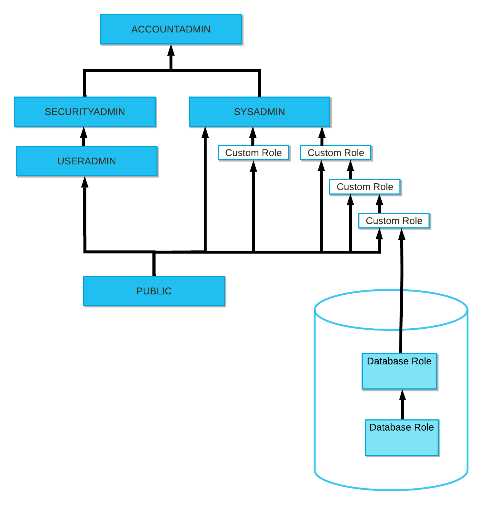

# 11. Security
These topics are intended primarily for admins (ACCOUNTADMIN, SYSADMIN, or SECURITYADMIN).

## Authentication
### API Authentication & Secrets
External API authentication let you authenticate to a service hosted outside of Snowflake. Snowflake supports these authentication methods for External API Authentication:
- Basic authentication (such as username and password).
- OAuth with code-grant/client-credentials flow.

In Snowflake, the authentication credentials are stored/accessed securely from an object called a `secret`, which is used with a connector to access a service outside of Snowflake. A secret is a schema-level object that stores sensitive information, limits access to the sensitive information using RBAC, and is encrypted using the master key in Snowflake key encryption hierarchy. 

If a user runs DESCRIBE SECRET on the secret, the password value stored in the secret is never exposed.

A `security integration for external API authentication` let Snowflake to connect to the service hosted outside of Snowflake with the OAuth flows.

### Federated Authentication and SSO
In a federated environment, user authentication is then passed to one or more services. So with one sign on, user can have access to Snowfake, Tableau, Gmail, etc. This env has two components:
- Service provider (SP): those who provide the service, such as Snowflake, Gmail, ...
- Identity provider (IdP): the one who maintains user credentials and authenticate them SSO to different services, such as Okta, MS Azure AD, ...

Federated authentication enables these SSO workflows:
- Logging into/out-of Snowflake.
- System timeout due to inactivity.

(configuration details skipped)

### Key Pair Authentication and Rotation
Snowflake supports key pair authentication as an alternative to basic authentication (username and password). You can generate the private-public key pair using OpenSSL. The public key is assigned to the user who uses any Snowflake client to connect/authenticate to sf. All sf clients support it. 

Snowflake supports rotating public keys, which allows compliance with more robust security and governance postures.

### Multi-Factor Authentication (MFA)
Snowflake supports multi-factor authentication (MFA) to provide increased login security. MFA support is an integrated Snowflake feature, powered by the Duo Security service, which is managed completely by Snowflake.

MFA is enabled on a per-user basis; however, users are not automatically enrolled in MFA - they must enroll themselves.

Snowflake strongly recommends that at least all users with the ACCOUNTADMIN role be required to use MFA.

### OAuth
OAuth is an open standard protocol that allows users to grant access to their protected resources on one website to another website/application without sharing their credentials. It is commonly used for authorization and secure access to APIs. OAuth uses tokens (access tokens & refresh tokens) to provide secure and limited access to the protected resources. The access token allows the client application to make authorized requests to the resource server on behalf of the user.

Snowflake supports the OAuth 2.0 protocol for authentication/authorization using one of these:
- Snowflake OAuth
- External OAuth

## Networking & Private connectivity
### Network Policies
For managing network configurations to Snowflake. A network policy allow you to create 
- an IP allowed list, 
- an IP blocked list, if desired.

`A security admin or higher, or someone with global CREATE NETWORK POLICY privilege, can create a network policy` to allow/deny access to a single IP address or a list of addresses.

Currently support only IPv4 addresses.

To activate a network policy, modify the account/user properties and assign the policy to the object. Only one network policy can be assigned to the account/one-user. Attaching a network policy to your account automatically replaces the existing network policy. 

`Security admin, or a higher role, or someone with the global ATTACH POLICY privilege can activate a network policy`.

Snowflake supports specifying ranges of IP addresses using CIDR notation. 

`It is possible to temporarily bypass a network policy for a set num of mins by configuring the user object property MINS_TO_BYPASS_NETWORK_POLICY. Contact Snowflake to set it. `

When a network policy includes values in both the allowed and blocked IP address lists, blocked IP address list takes precedence.

Do not add `0.0.0.0/0` to the blocked IP address list. This means "all IPv4 addresses on the local machine".

Your current IP address must be included in the allowed IP addresses in the policy.

Network policies can be managed through Snowsight, the Classic Console, or SQL. 

Snowflake supports replication and failover/failback for network policies. 

### AWS VPC Interface Endpoints for Internal Stages (business critical edition +)
Connect to Snowflake internal stages via AWS VPC Interface Endpoints.

### Azure Private Endpoints for Internal Stages (business critical edition +)
Connect to Snowflake internal stages via Microsoft Azure Private Endpoints.

### AWS PrivateLink (business critical edition +)
Configure AWS PrivateLink to directly connect Snowflake to one or more AWS VPCs. 

### Azure PrivateLink (business critical edition +)
Configure Azure Private Link to connect your Azure VNet to the Snowflake VNet in Azure.

### Google Cloud Private Service Connect (business critical edition +)
Configure Google Cloud Private Service Connect to connect your Google Cloud VPC network subnet to your Snowflake account hosted on GCP without traversing the public Internet.

## Administration & Authorization
### Sessions and Session Policies (Enterprise edition +)
A session begins when a user connects to Snowflake and authenticates successfully. A session is independent of an IdP session. If the Snowflake session expires but the IdP session remains active, a user can log in to Snowflake without entering their login credentials again (silent authentication).

A session is maintained indefinitely with continued user activity. After a period of inactivity in the session (the idle session timeout), the user must authenticate to Snowflake again. The idle session timeout has a maximum value of four hours and can be modified by session policy. 

The idle session timeout applies to:
- Classic Console.
- Snowsight.
- SnowSQL.
- Supported connectors and drivers.
- Third-party clients that connect to Snowflake using a supported connector or driver.

Snowflake recommends reusing existing sessions when possible, and closing the connection to Snowflake when a session is no longer needed.

In the GUI, Snowflake creates a new session every time a new worksheet is created, and the idle timeout for each worksheet is tracked separately. When a worksheet is closed, the user session for the worksheet ends. After the 4-hr time limit expires for any open worksheet, Snowflake logs the user out of the web interface.

A session policy:
- defines the idle session timeout period in minutes 
- can override `the default idle timeout value of 4 hrs`.

The session policy can be set for an account/user. If a user is associated with both an account and user-level session policy, the user-level session policy takes precedence. 

2 properties that govern the session policy behavior:
- SESSION_IDLE_TIMEOUT_MINS for programmatic and Snowflake Clients.
- SESSION_UI_IDLE_TIMEOUT_MINS for the Classic Console.

If a session policy is not set, Snowflake uses a default value of 4 hrs. The min configurable idle timeout value for a session policy is 5 mins. 

If a client supports the `CLIENT_SESSION_KEEP_ALIVE` option and it is set to TRUE, the client preserves the Snowflake session indefinitely as long as the connection is active. Avoid using this option - it can result in many open sessions, and place a greater demand on resources, which can lead to a performance degradation.

### SCIM
SCIM is an open specification to help facilitate the automated management of user ids and groups (i.e. roles) in cloud applications using RESTful APIs. These APIs use common methods (e.g. GET, POST) with key-value pair attributes in JSON format.

### Access Control Introduction
Snowflake's access control combines aspects from both:
- Discretionary Access Control (DAC): Each object has an owner, who can grant access to that object.
- Role-based Access Control (RBAC): Access privileges are assigned to roles, which are assigned to users.

Each securable object is owned by a single role, which by default is the role who created the object. 

In a `regular schema`, the owner role has all privileges on the object by default, including the ability to grant/revoke privileges on the object to other roles. However, in a `managed access schema`, object owners lose the ability to make grant decisions. Only the "schema owner or a role with the MANAGE GRANTS privilege" can grant privileges on objects in the schema.

A role owner (the role that has the OWNERSHIP privilege on the role) does not inherit the privileges of the owned role. Privilege inheritance is only possible within a role hierarchy.

Do not recommend to grant additional privileges to system-defined roles. It is not recommended to mix account-management privileges and entity-specific privileges in the same role.

Types of Roles:
- Account roles
- Database Roles - lives in a single db

System-Defined Roles:
- ORGADMIN: create/view accounts, view usage info
- ACCOUNTADMIN: highest role in the system. Should be granted to a limited number of users in your account.
- SECURITYADMIN: manage object grants globally, create/monitor/manage users & roles. 
- USERADMIN: create/manage users and roles
- SYSADMIN: create warehouses and database objects. Grant privileges on warehouses/databases/objects to other roles.
- PUBLIC: automatically granted to every user and every role. the objects owned by the role are available to every other user and role.

For existing objects, privileges must be granted on individual objects. Future Grants allow defining an initial set of privileges on objects created in a schema. 

Role hierarchy diagram: 

Database roles that are granted to a share can be granted to other database roles, as well as account roles. If a database role is granted to a share, then no other database roles can be granted to that database role (db roles in a share has to be lowest in the tree, cannot have any children). 

Every active user session has a current role (`primary role`). In addition, any number of `secondary roles` can be activated concurrently in a user session. A user can perform SQL actions on objects in a session using the aggregate privileges granted to the primary and secondary roles. Secondary roles are particularly useful for SQL operations such as cross-database joins that would otherwise require creating a parent role of the roles that have permissions to access the objects in each database.

A database role can not be a primary/secondary role. Grant the database role to an account role to use their privileges. AKA - Only account roles can be activated in a session.

Authorization to execute CREATE statements comes from the primary role only. For other SQL actions, any permission granted to any active primary/secondary role can be used to authorize the action.

### Access Control Considerations
The account admin: 
- is the most powerful role in the system
- alone is responsible for configuring parameters at the account level
- can view and manage Snowflake billing and credit data, and stop any running SQL statements.

Note that ACCOUNTADMIN is not a superuser role. This role only allows viewing and managing objects in the account if this role, or a role lower in a role hierarchy, has sufficient privileges on the objects.

Recommend these for account admin:
- Assign it only to a select/limited number of people.
- All users of this role should use MFA to login
- Assign this role to at least two users. So they can reset each other's passwords.
- It should not be used to create objects unless absolute necessary. 
- Do not make ACCOUNTADMIN the default role for any users in the system. 
- Avoid using the ACCOUNTADMIN for automated scripts

Recommend creating a hierarchy of roles aligned with business functions and ultimately assigning these roles to the SYSADMIN. 

When a custom role is first created, it exists in isolation. By default, not even the ACCOUNTADMIN role can modify or drop objects created by a custom role. The custom role must be granted to the ACCOUNTADMIN role directly/indirectly. 

For optimal flexibility in access control, create object `access roles` with different object permissions (such as db1_r, db1_rw, ...), and grant them to `functional roles` (such as analyst, data_engineer, ...). These functional roles can can form their own hierarchy. 

Database roles, scope is the db that they live in:
- Ease of management: Database owners can create & manage db roles, grant privileges to db roles, grant db roles to other db roles in the same db. 
- Data share: can be used in data share, instead of one IMPORTED PRIVILEGES to all. 

`Only the user who executed a query can access the query results - other users cannot see it, not even account admins.` 

A cloned object is considered a new object in Snowflake. Any privileges granted on the source object do not transfer to the cloned object. However, a cloned container object (database/schema) retains any privileges granted on the objects contained in the source object. Eg, a cloned schema retains any privileges granted on the tables, views, UDFs, and other objects in the source schema.

### Access Control Privileges
"https://docs.snowflake.com/en/user-guide/security-access-control-privileges". 

### Access Control Configuring
Grants of privileges on a source object (i.e. database) are not copied to its clones, but privilege grants on all child objects (i.e. tables in the database) are copied to the clones.

CREATE/ALTER SCHEMA statement with the `WITH MANAGED ACCESS` keywords will turn the schema into a managed access schema.

### End-to-End Encryption
End-to-end encryption (E2EE) is a method to secure data that prevents 3rd parties from reading data while at-rest, or in transit, to and from Snowflake, and to minimize the attack surface.

For data loading: 
- For an external stage, the user can optionally encrypt the data files using client-side encryption, which Snowflake recommend. But if the data is not encrypted, Snowflake immediately encrypts the data when it is loaded into a table.
- For an internal stage, data files are automatically encrypted by the Snowflake client on the user's local machine, before being transmitted to the internal stage.

For data unloading, results are optionally encrypted using client-side encryption for external stage (then user downloads data files and decrypts it on the client side), and are automatically encrypted for internal stage.

Client-side encryption: a client encrypts data before copying it into a cloud storage staging area.

The client-side encryption protocol works as follows:
- The customer creates a "secret master key", which is shared with Snowflake.
- The client generates a "random encryption key" and encrypts the file before uploading it into cloud storage. The random encryption key is encrypted with the customer's master key, and becomes the "encrypted random key".
- Both the encrypted file and the "encrypted random key" are uploaded to the cloud storage service. The "encrypted random key" is stored with the file's metadata.

When downloading data, the client downloads both the encrypted file and the encrypted random key. The client decrypts the encrypted random key using the customer's master key. Next, the client decrypts the encrypted file using the now decrypted random key. This encryption and decryption happens on the client side.

At no time does the cloud storage service, or any other 3rd party, see the data in the clear. Customers may upload client-side encrypted data using any client or tool that supports client-side encryption.

When you create a stage with a master key associated to it, the master key is transmitted over HTTPS to Snowflake and is stored encrypted in metadata storage. A benefit of named stage objects is that they can be granted to other users without revealing access credentials or client-side encryption keys to those users. 

### Encryption Key Management
Snowflake manages data encryption keys automatically to protect customer data. This management is transparent for customers.

Customers can use the key management service in the cloud platform that hosts their Snowflake account to maintain their own additional encryption key. When enabled, the combination of a Snowflake-maintained key and a customer-managed key creates a composite master key to protect the Snowflake data. This is called `Tri-Secret Secure` (for Business Critical Edition &+).

Snowflake uses AES 256-bit encryption, with a hierarchical key model rooted in a `hardware security module`. `Keys are automatically rotated every 30 days` (new key encrypts new data files), and data can be automatically re-encrypted (rekeyed) on a regular basis (rekeying needs Enterprise Edition &+). 

The hierarchy is composed of several layers of keys, each higher layer of keys (parent keys) encrypts the layer below (child keys). In security terminology, a parent key encrypting all child keys is known as `wrapping`.

Snowflake's hierarchical key model consists of four levels of keys:
- The root key
- Account master keys
- Table master keys
- File keys

In a multi-tenant cloud service like Snowflake, the hierarchical key model isolates every account, with the use of separate account master keys. In addition to the access control model, the hierarchical key model provides another layer of account isolation. 

`If periodic rekeying is enabled, when the retired encryption key for a table is older than 1 year, Snowflake automatically creates a new encryption key and re-encrypts all data previously protected by the retired key using the new key.` The new key is used to decrypt the table data going forward. The retired keys can then be destroyed. 

Snowflake rekeys data files online, in the background, without any impact to currently running customer workloads. Data that is being rekeyed is always available to you.

Snowflake customers are charged with additional storage for Fail-safe protection of data files that were rekeyed. For these files, 7 days of Fail-safe protection is charged. Eg, the data files (micro-partitions) with the old key on Amazon S3 are already protected by Fail-safe, and the data files with the new key on Amazon S3 are also added to Fail-safe, leading to a second charge, but only for the 7-day period.

Snowflake does not support key rotation for customer-managed keys and does not recommend implementing an automatic key rotation policy on the customer-managed key.

If the customer-managed key in the composite master key hierarchy is revoked, your data can no longer be decrypted by Snowflake, providing a level of security and control above Snowflake's standard encryption. 

