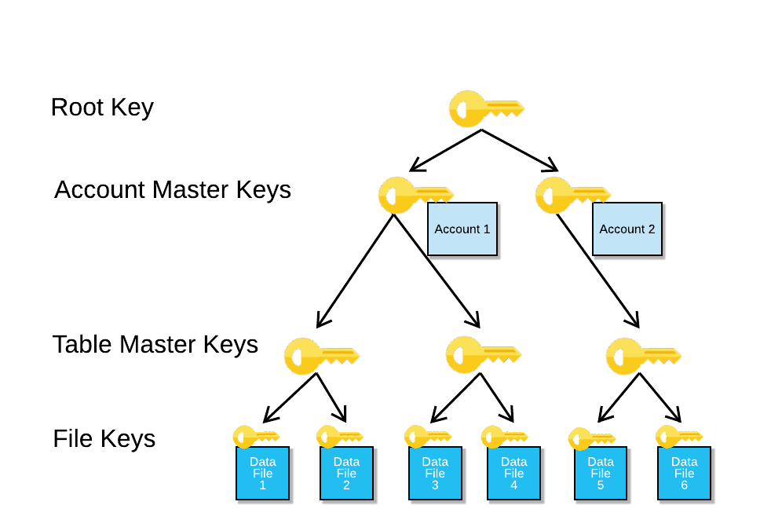

# 12. Data governance
## Data Quality Monitoring (Enterprise &+)
### Introduction
Data Quality uses data metric functions (DMFs), which include Snowflake-provided system DMFs and user-defined DMFs, to monitor the state and integrity of your data. You can use DMFs to measure key metrics, such as, but not limited to, freshness, duplicates, NULLs, and unique values.

Snowflake provides built-in system DMFs in the SNOWFLAKE.CORE schema to measure common metrics without having to define them. You can also define your own custom DMFs to fine-tune your data quality measurements more precisely, and these DMFs are stored in the database and schema of your choice.

After you assign a DMF to a table or view, Snowflake records the results of calling the DMF in the event table for your account. You can specify the schedule for how often the DMF is called. All DMFs that are set on the table follow the same schedule.

After you schedule the DMFs to run, you can configure alerts to notify you when changes to data quality occur. 

Snowflake creates and manages the virtual warehouse objects to support this feature. 

DMF limitations:
- Only regular tables are supported. dynamic/external table etc not supported.
- You cannot grant privileges on a DMF to share or set a DMF on a shared table/ view.
- Using the CLONE operation and the CREATE TABLE ... LIKE operation does not result in DMF assignments on the target object.
- You cannot set a DMF on objects in a reader account.
- You cannot create a dynamic table or a stream based on the data in the event table.
- Trial accounts and accounts within the U.S. SnowGov regions do not support this feature.

### System DMFs
list:
- freshness(): secs between max timestamp col, and the scheduled time. 
- data_metric_scheduled_time(): Returns the timestamp for when a DMF is scheduled to run, or the current_timestamp if the function is called manually.
- null_count(): total num of NULLs for the specified col in a table.
- duplicate_count(): num of vals that has duplicates, including NULLs. 
- unique_count(): basically count(distinct ...)
- row_count(): basically count(*)

## Data sensitivity & Access visibility
### Object Tagging (Enterprise Edition &+)
Tags enable data stewards to monitor sensitive data. A tag is a schema-level object that can be assigned to another Snowflake object.

A single tag can be assigned to different object types at the same time (e.g. warehouse and table simultaneously). At the time of assignment, the tag string value can be duplicated or remain unique. 

For example, multiple tables can be assigned the cost_center tag and the tag can always have the string value be sales. Alternatively, the string value could be different (e.g. engineering, marketing, finance). `After defining the tags and assigning the tags to Snowflake objects, tags can be queried to monitor usage on the objects. `

Tags can be assigned to tables/views/columns, setting a tag and then querying the tag enables the discovery of database objects and columns that contain sensitive information. 

Assigning tags to warehouses enables accurate resource usage monitoring. Querying tags on resources allows for easy resource grouping by cost center or other organization units. The tag can also facilitate analyzing short-term business activities, such as projects, to provide a more granular insight into what/when/how resources were used.

`The string value for each tag can be up to 256 characters, with the option to specify allowed values for a tag.`

`Snowflake allows max 50 unique tags to be set on a single object directly.` If the object is a table/view, additional 50 tags are allowed to set on its columns. 

Dropped tag can be undropped within 1 day. 

Tag inheritance: if a tag is applied to a table, the tag also applies to the columns in that table - also called `tag lineage`. Since tags are inherited, applying the tag to objects higher in the securable objects hierarchy results in the tag being applied to all child objects. You can override an inherited tag on a given object. For example, if a table column inherits the tag named cost_center with a string value called sales, the tag can be updated with a more specific tag string value such as sales_na, to specify the North America sales cost center. Additionally, a new tag can be applied to the table column.

Tags can get replicated. 

The max num in allowed string values (ALLOWED_VALUES) for a single tag is 50.

A masking policy directly assigned to a column takes precedence over a tag-based masking policy.

With CREATE TABLE ... LIKE, tags assigned to the source table are assigned to the target table.

Tag attached to the source object are cloned to the cloned objects. Tag objects that lives inside a container will also be cloned if the container got cloned. 

Snowflake supports different permissions to create and set a tag on an object:
1. centralized approach - tag_admin create tags, and apply tags
2. hybrid approach - tag_admin create tags, and assign other roles to apply tags

### Data Classification (Enterprise Edition &+)
Classification: a multi-step process that associates Snowflake-defined tags (system tags) to columns, by analyzing the cells and metadata for personal sensitive data, which can now be tracked by a data engineer, they then can protect it with a masking policy, or a row access policy.

Classification simplifies to a three-step process: 
1. analyze - The data engineer calls the `EXTRACT_SEMANTIC_CATEGORIES(table_name)` function, which analyzes table columns, and outputs the possible categories and their probabilities. 
2. review - the data engineer manually reviews the category results, to ensure the results of the previous step make sense.
3. apply - The data engineer manually set a system tag on a column, or call the ASSOCIATE_SEMANTIC_CATEGORY_TAGS SP. Then they can track the system tag, and protect the sensitive data with a masking policy, or a row access policy.

You can classify table and view columns for all data types, except these 3:
- GEOGRAPHY
- BINARY
- VARIANT

The classification process requires compute resources. Recommend to use a larger warehouse size if the table has many many columns. 

## Data access policies
### Masking Policies (Enterprise Edition &+)
Column-level Security allows applying a masking policy to a table's/view's column. This includes:
1. Dynamic Data Masking - uses masking policies to mask plain-text data in table and view columns at query time. 
2. External Tokenization - allow accounts to tokenize data before loading it into Snowflake, and detokenize the data at query runtime. Uses masking policies with `external functions`.

Masking policy is a schema-level object. 

When users execute a query, the masking policy conditions determine whether the user see masked, partially masked, obfuscated, or tokenized data. Eg, masking policy admin can implement a masking policy such that analysts can only view the last 4 digits of a phone number and none of the social security number, while customer support representatives can view the entire phone number and social security number for customer verification use cases.

You can apply a masking policy to one or more table/view columns.

Snowflake supports nested masking policies, eg, a masking policy on a table, and a masking policy on a view that refers to that table.

Since tokenization provides a unique value for a given set of characters, it is possible to group records by a tokenized value without revealing the sensitive information.

For a table/view, the same column cannot be used in both [masking policy] and [row access policy] at the same time.

Snowflake allows setting a masking policy on a materialized view column. 

A masking policy cannot be set on a table column if a materialized view is already created from the underlying table.

`If a masking policy is set on an underlying table column and a materialized view is created from that table, the materialized view only contains columns that are not protected by a masking policy. `

Hashing and cryptographic/checksum can be used in masking policies to mask sensitive data.

`You can apply the masking policy to the external table VALUE column using ALTER TABLE .. ALTER COLUMN on the external table.` `A policy cannot be set on any other external table column, including user-added virtual columns.` If these columns need to be protected, create a view on the external table and apply a policy to the view column.

Masking policies on columns in a table carry over to a stream on the same table.

Cloning an individual policy object is not supported. Cloning a schema results in the cloning of all policies within the schema. A cloned table maps to the same policies as the source table.

Executing a CREATE TABLE ... AS SELECT populates masked data in the new table. 

You CAN use `count(distinct col_name)` on a view that refers to a table that uses this masked column. 

`A UDF can be passed into the masking policy conditions.`

Masking policies and their assignments can be replicated using database replication and replication groups.

3 security approaches:
1. centralized - security officer creates an applies policies
2. hybrid - security officer creates policies, individual teams apply them
3. decentralized - individual teams create and apply policies

A `tag-based masking` policy combines the object tagging and masking policy, allows a masking policy to be set on a tag using an ALTER TAG command. 

The tag can support one masking policy for each supported Snowflake data type. For example, if a tag already has a masking policy for the NUMBER data type, you cannot assign another masking policy with the NUMBER data type to the same tag.

Assigning a tag-based masking policy to a table automatically applies the masking policy to any new table columns. This behavior is analogous to future grants.

### Row Access Policies
Snowflake supports row-level security via row access policies, which determines which rows to return in the query result. The row access policy use simple row filtering allow one particular role to view rows, or include a mapping table in the policy definition to determine access to rows.

A row access policy is a schema-level object, which determines whether a given row in a table/view can be viewed from Select or dml commands. It uses Conditional Expression Functions, and Context Functions, to determine which rows should be visible in a given context.

Snowflake does not support attaching a row access policy to the stream object itself, but does apply the row access policy to the table when the stream accesses a table protected by a row access policy.

IS_ROLE_IN_SESSION cannot be used with row access policies that contain mapping tables.

When a database object has both a row access policy and masking policies, Snowflake evaluates the row access policy first.

Simulate how a policy will work: call the `POLICY_CONTEXT` function. 

You can create/apply an external table with a row access policy. Snowflake does not support using external tables as a "mapping table" in a row access policy.

Snowflake supports adding a row access policy to a materialized view provided that a row access policy is not set on its underlying table.

In the EXPLAIN command result and the query profile, Snowflake does not show users any row access policy information (i.e. policy name, policy signature, policy expression), nor the objects accessed by the policy.

Row access policies and their assignments can be replicated using database replication and replication groups.

You can also use a centralized, hybrid, or decentralized approach to manage row access policies. 

You can replace existing row access policy subqueries with memoizable functions to increase query performance. (??? Need more investigation)

## Data lineage & Dependencies
### Access History (Enterprise Edition &+)
The user access history (Select or DML commands) can be found with the Account Usage ACCESS_HISTORY view.

These records helps regulatory compliance auditing, and provide insights on popular (frequently accessed) tables/columns, since there is a direct link between the user, the query, the table or view, the column, and the data.
- query_id
- query_start_time
- user_name
- direct_objects_accessed: read objects referred to directly in the query
- base_objects_accessed: read objects referred by direct objects
- objects_modified: modified objects in a query
- object_modified_by_ddl
- policies_referenced

### Object Dependencies
Account Usage view OBJECT_DEPENDENCIES.

*** Note: below are from old docs. ***

## 🏷  RBAC best practices
RBAC is a journey - as the company grows, existing RBAC might need modifications. 

`ACCOUNTADMIN` role is the most powerful role in the system, it alone is responsible for `configuring parameters at the account level`. It is intended for performing `initial setup tasks` in the system and `managing account-level objects and tasks` on a day-to-day basis. In the system role hierarchy, other admin roles are children of it:
- `USERADMIN`: has privileges to `create and manage users and roles` (assuming ownership of those roles or users has not been transferred to another role).
- `SECURITYADMIN`: has global MANAGE GRANTS privilege to `grant or revoke privileges on objects in the account`. The USERADMIN role is its child role in the default access control hierarchy.
- `SYSADMIN`: has privileges to `create warehouses, databases, and all database objects`.

By default, when your account is provisioned, the first user is assigned the ACCOUNTADMIN role. This user should then create users who are assigned the USERADMIN role. `All remaining users should be created by USERADMIN or another role that is granted the global CREATE USER privilege`.

**ACCOUNTADMIN best practices:**
- Assign it only to a `limited number of people`.
- All users with this role should use multi-factor authentication (`MFA`) for login.
- Assign it to `at least two users`. So avoids having to go through complex resetting procedures because they can reset each other's passwords.
- Associate an `actual person's email address` to its users, so Snowflake knows who to contact in an urgent situation.
- `Do not` make it the `default role` for any users
- `Do not` use it for `automated scripts`

Recommend: create a `hierarchy of roles` aligned with `business functions` in your organization and `ultimately` `assign then to SYSADMIN`. So all warehouse and database object operations can be performed using the SYSADMIN role or lower roles in the hierarchy. And creating or modifying users or roles performed by SECURITYADMIN role or another role with right privileges.

To access database objects, in addition to the privileges on the specific database objects, users must be granted the `USAGE` privilege on their `database and schema`.

When `a custom role is first created`, it exists in isolation. It must then be assigned to users who need to use the role. It must also be granted to roles that manages the objects created by it. By default, not even ACCOUNTADMIN can modify or drop objects created by it. It must be granted to the ACCOUNTADMIN role directly or indirectly as the parent.

In a role hierarchy, roles are granted to other roles to form an inheritance relationship. Permissions granted to roles at a lower level are inherited by roles at a higher level.

**RBAC creation best practices:**
- `Grant permissions` on database objects or account objects to `access roles`.
- Assign (Give) access roles to (->) `functional roles`. (Functional roles correspond to the business functions.)
- When appropriate, grant `lower-level functional roles` to `higher-level functional roles` in a parent-child relationship where the parent roles map to business functions.
- Grant the `highest-level functional roles` via a role hierarchy to the SYSADMIN.

There is no technical difference between an object `access role` and a `functional role` in Snowflake. The difference is `logical`. 

Refer to `https://docs.snowflake.com/en/user-guide/security-access-control-considerations.html`.

To further lock down object security, consider using managed access schemas. In a managed access schema, object owners lose the ability to make grant decisions. Only the schema owner (i.e. the role with the OWNERSHIP privilege on the schema) or a role with the MANAGE GRANTS privilege can grant privileges on objects in the schema, including future grants, centralizing privilege management.

For security reasons, only the user who executed a query can access the query results.

A cloned container object (a database or schema) retains any privileges granted on the objects inside the container. e.g., a cloned schema retains any privileges granted on the tables, views, UDFs, and other objects in this schema. 

## Data Encryption
End-to-end encryption (E2EE) is a method to secure data that prevents third parties from reading data while at-rest or in transit to and from Snowflake and to minimize the attack surface.

Client-side encryption means that a client encrypts data before copying it into a cloud storage staging area. It follows a specific protocol defined by the cloud storage service. The service SDK and third-party tools implement this protocol. The client-side encryption protocol works as follows:
1. The customer creates a secret master key, which is shared with Snowflake.
2. The client, which is provided by the cloud storage service, generates a random encryption key and encrypts the file before uploading it into cloud storage. The random encryption key, in turn, is encrypted with the customer's master key.
3. Both the encrypted file and the encrypted random key are uploaded to the cloud storage service. The encrypted random key is stored with the file's metadata.

When downloading data, the client downloads both the encrypted file and the encrypted random key. The client decrypts the encrypted random key using the customer's master key. Next, the client decrypts the encrypted file using the now decrypted random key. This encryption and decryption happens on the client side. At no time does the cloud storage service or any other third party (such as an ISP) see the data in the clear. Customers may upload client-side encrypted data using any client or tool that supports client-side encryption.

### Encryption Key Management in Snowflake
Tri-Secret Secure (business critical feature): Snowflake manages data encryption keys to protect customer data. This management occurs automatically without any need for customer intervention. Customers can use the key management service in the cloud platform that hosts their Snowflake account to maintain their own additional encryption key. When enabled, the combination of `a Snowflake-maintained key` and `a customer-managed key` creates `a composite master key` to protect the Snowflake data. This dual-key encryption model, together with Snowflake's built-in user authentication, enables the three levels of data protection offered by `Tri-Secret Secure`.

Snowflake uses strong `AES 256-bit encryption` with a `hierarchical key model` rooted in a hardware security module. A hierarchical key model provides a framework for Snowflake's encryption key management. The hierarchy is composed of several layers of keys in which `each higher layer of keys (parent keys) encrypts the layer below (child keys)`. Snowflake's hierarchical key model consists of four levels of keys: The root key, Account master keys, Table master keys, File keys. 

### Encryption Key Rotation
All Snowflake-managed keys are automatically rotated when they are more than 30 days old. When active, a key is used to encrypt data and is available for usage by the customer. When retired, the key is used solely to decrypt data and is only available for accessing the data. Regular key rotation limits the life cycle for the keys to a limited period of time.

### Periodic Rekeying (Enterprise edition feature)
While key rotation ensures that a key is transferred from its active state to a retired state, rekeying ensures that a key is transferred from its retired state to being destroyed. If periodic rekeying is enabled, then when the retired encryption key for a table is older than one year, Snowflake automatically creates a new encryption key and re-encrypts all data previously protected by the retired key using the new key. The new key is used to decrypt the table data going forward.

## 🏷  Governance
### Column-level Security （enterprise edition feature)
Allows for masking a column within a table or view. Contains two features:
- Dynamic Data Masking: Uses masking policies to selectively mask plain-text data in table and view columns at query time. The masking policy conditions determine whether unauthorized users see masked, partially masked, obfuscated, or tokenized data. 
- External Tokenization: tokenize data (remove sensitive data by replacing it with an undecipherable token) before loading it into Snowflake and detokenize the data at query runtime.

One masking policy can be applied to many tables and views. Masking policies support `segregation of duties (SoD)` through the role separation of policy administrators from object owners. Secure views do not have SoD, which is a profound limitation to their utility. With masking policy, object owners cannot unset masking policies, and cannot view the masked columns. 

Conditional masking uses a masking policy to selectively protect the column data in a table or view based on the values (such as visibility) in other column(s).

Best practices for using masking policy:
- Use caution when apply masking policies to columns.
- Query the masked columns before making tables and views available to users.
- Note target columns in additional tables and views where the data in the source column may appear.

Snowflake allows setting a masking policy on a materialized view column. 

A masking policy that is directly assigned to a column takes precedence over a tag-based masking policy.

Executing a CREATE TABLE ... AS SELECT (CTAS) statement applies any masking policies on columns included in the statement before the data is populated in the new table. To copy unmasked data, use a role authorized for protected data to run the CTAS statement. 

Masking policies and their assignments can be replicated using database replication and replication groups.

Managing Column-level Security: Consider whether your approach to masking data in columns should follow a centralized security approach, a decentralized approach, or a hybrid of each of these two approaches.

Centralized management: Security officer create and apply policies. 
Decentralized management: Individual teams create and apply policies.
Hybrid Management: Security officer create policies, individual teams apply them. 

DDLs to manage column-level masking policy: 
- CREATE MASKING POLICY
- ALTER MASKING POLICY 
- DROP MASKING POLICY
- SHOW MASKING POLICIES
- DESCRIBE MASKING POLICY

### Row Access Policies
A given table/view column cannot be specified in masking policy and row access policy at the same time.

A row access policy is a schema-level object that determines whether a given row in a table or view can be viewed from the following types of statements: SELECT statements, and rows selected by UPDATE, DELETE, and MERGE statements. A single policy can be set on different tables and views at the same time.

A row access policy condition can reference a mapping table to filter the query result set, however using mapping tables may result in decreased performance compared to the more simple example.

